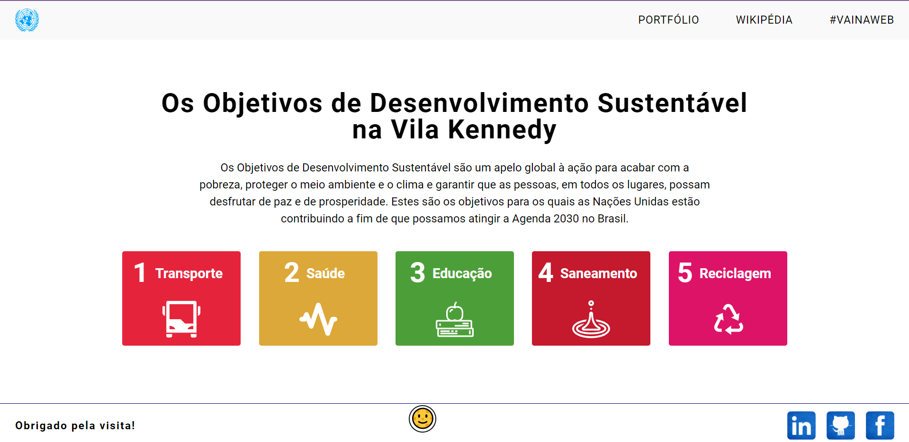
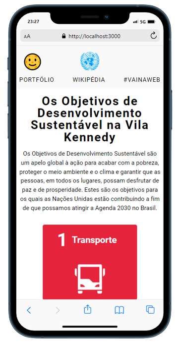

<h1>Desenvolvimento Sustentável - ONU</h1>

<h4>Sobre</h4>
- Foi nos solicitado falar sobre o Bairro e maneiras de implementar a Agenda 2030 dá ONU.

<h4>Falei sobre os seguintes temas:</h4>
<li>Transporte</li>
<li>Saúde</li>
<li>Educação</li>
<li>Saneamento Básico</li>
<li>Reciclagem</li>

<h2>Preview:</h3>
<h3>Desktop:</h3>

<h3>Tablet:</h3>

<h3>Mobile:</h3>

<h2>Agradecimentos:</h2>
<li>- LuisAndrade18 por te me ajudado com o Modal :satisfied:.</li>
<li>- Luciana Lima deu uma mão monstruosa com os textos :relaxed:.</li>

<h3>Link para o Site: <strong>https://onu-csl.netlify.app/</strong></h3>

PS: Fiz uma boa pesquisa pensando em Acessibilidade (ARIA), pensando nas ferramentas usadas para leitura de tela, espero que tenha dado frutos :star_struck:.

